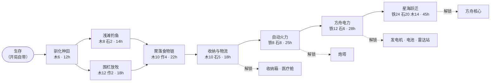
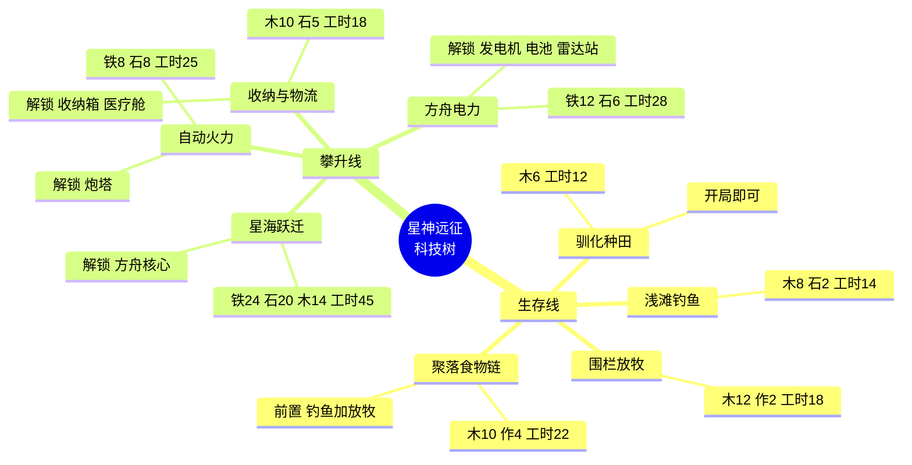
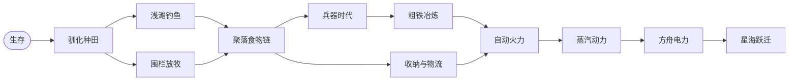

# 科技树

用来生成思维导图。**当前实际生效的是"一、现行科技树"这 8 个节点**，[tech_tree.gd](../AIColonyDemo/script/data/tech_tree.gd) 里还有一份 11 节点的旧草案，见文末附录。

---

## 一、现行科技树（8 节点，游戏里真正跑的）

数据源：[main.gd:19-29](../AIColonyDemo/script/core/main.gd#L19-L29) 的 `TECHS` / `TECH_ORDER`。

### 思维导图（markmap / 大纲式）

复制下面整块，粘进支持 markmap 的编辑器（VS Code 装 Markmap 插件、或 markmap.js.org）即可出图。

```markdown
# 星神远征 · 科技树

## 生存线（食物）
### 驯化种田
- 消耗：木材 6
- 工时：12
- 前置：无（开局即可研究）
- 解锁建筑：（无，纯前置）
#### 浅滩钓鱼
- 消耗：木材 8、石头 2
- 工时：14
- 前置：驯化种田
- 解锁建筑：（无，纯前置）
#### 围栏放牧
- 消耗：木材 12、作物 2
- 工时：18
- 前置：驯化种田
- 解锁建筑：（无，纯前置）
##### 聚落食物链
- 消耗：木材 10、作物 4
- 工时：22
- 前置：浅滩钓鱼 + 围栏放牧（**两个都要**）
- 解锁建筑：（无，纯前置）

## 攀升线
### 收纳与物流
- 消耗：木材 10、石头 5
- 工时：18
- 前置：聚落食物链
- 解锁建筑：收纳箱、医疗舱
#### 自动火力
- 消耗：铁矿 8、石头 8
- 工时：25
- 前置：收纳与物流
- 解锁建筑：炮塔
##### 方舟电力
- 消耗：铁矿 12、石头 6
- 工时：28
- 前置：自动火力
- 解锁建筑：发电机、电池、雷达站
###### 星海跃迁
- 消耗：铁矿 24、石头 20、木材 14
- 工时：45
- 前置：方舟电力
- 解锁建筑：方舟核心（建成即可跃迁）
```


### 关系图（Mermaid）

支持 Mermaid 的编辑器（Typora、Obsidian、GitHub、语雀）直接就能渲染：




### 换成 Mermaid mindmap 语法

有些工具只认 `mindmap`。注意圆括号和斜杠在 mindmap 里会炸语法，所以这里去掉了：




### 一览表


| 顺序  | id           | 名称    | 消耗             | 工时  | 前置          | 解锁建筑       |
| --- | ------------ | ----- | -------------- | --- | ----------- | ---------- |
| 1   | `farming`    | 驯化种田  | 木 6            | 12  | —           | 无          |
| 2   | `fishing`    | 浅滩钓鱼  | 木 8、石 2        | 14  | 驯化种田        | 无          |
| 3   | `husbandry`  | 围栏放牧  | 木 12、作 2       | 18  | 驯化种田        | 无          |
| 4   | `food_chain` | 聚落食物链 | 木 10、作 4       | 22  | 钓鱼 **且** 放牧 | 无          |
| 5   | `logistics`  | 收纳与物流 | 木 10、石 5       | 18  | 聚落食物链       | 收纳箱、医疗舱    |
| 6   | `defense`    | 自动火力  | 铁 8、石 8        | 25  | 收纳与物流       | 炮塔         |
| 7   | `power`      | 方舟电力  | 铁 12、石 6       | 28  | 自动火力        | 发电机、电池、雷达站 |
| 8   | `launch`     | 星海跃迁  | 铁 24、石 20、木 14 | 45  | 方舟电力        | 方舟核心       |


`survival`（生存）是根节点，代码里默认解锁（[main.gd:56](../AIColonyDemo/script/core/main.gd#L56) `unlocked_tech = {"survival": true}`）。

---


## 二、研究的前置条件（不只是科技）

光有点数不够，还有两条硬门槛，画思维导图时值得单列一支：

1. **必须已经建成研究台。** 研究台本身**不需要任何科技解锁**，木 10 + 铁 4 就能规划——所以流程是先手工建研究台，再开始点科技（[main.gd:1077-1082](../AIColonyDemo/script/core/main.gd#L1077-L1082) `has_research_bench()`）。
2. **材料要现付。** 点科技时立刻扣掉消耗（[main.gd:1098-1102](../AIColonyDemo/script/core/main.gd#L1098-L1102)），不是研究完才扣。

另外一次只能研究一项（`research_active()`），研究劳动由殖民者在研究台投入，进度按 `research_progress / work` 涨。

### 一开始就能建的（零科技）

城墙、城墙加固、门、地板、地板加固、火把、篝火、农田、床、工作台、研究台 —— **11 项**。

---


## 三、当前设计上的两个问题

写在前面，供你做思维导图时决定要不要保留这个形状：

### 1. 食物线四个科技目前不解锁任何东西

驯化种田 / 浅滩钓鱼 / 围栏放牧 / 聚落食物链，`can_build()` 里**一个建筑都没挂**（[main.gd:1022-1029](../AIColonyDemo/script/core/main.gd#L1022-L1029)）。它们的作用纯粹是"往攀升线走的过路费"。

代价是玩家体感：花 4 次研究的材料和时间，换来的是**零个新按钮**，只有描述文字里说的"效率提升"——但描述里承诺的改良农田、补种收割效率，代码里并没有对应的数值改动。

要么给这 4 个科技挂上实际的增益（农田产量、自动补种速度、食物上限），要么补 2~3 个食物类建筑（渔场、畜栏、粮仓）让它们真有东西可解锁。**这是现在科技树手感最空的一段。**

### 2. 攀升线是一条直线，没有分叉

聚落食物链 → 物流 → 火力 → 电力 → 跃迁，**每一层只有一个节点，没有选择**。玩家点科技时其实没有决策，只是按顺序付材料。思维导图上这会表现为一条单调的斜线，不好看也不好卖。

要让它有"树"的样子，起码需要在一个节点上开出两条并行支线（比如"火力线"和"民生线"分家），最后再合流到跃迁。附录里那份 11 节点草案就是这个方向。

---


## 四、附录：11 节点旧草案（**未接线，仅供参考**）

[tech_tree.gd](../AIColonyDemo/script/data/tech_tree.gd) 里有一份更完整的定义，带 `age`（时代）分组、多了 `weapon_age` / `smelting` / `steam_power` 三个节点，并且把 `defense` 的前置改成 `smelting + logistics`、`power` 改成依赖 `steam_power`。

**但这份数据在代码里没有任何引用**——我全文搜过，只有它自己的 `class_name`。游戏跑的是 main.gd 里那份。看起来是设计过更完整的版本但没接上。

它的形状是这样的：




时代分组（`age`）：


| 时代   | 节点                   |
| ---- | -------------------- |
| 生存   | 驯化种田、浅滩钓鱼、围栏放牧、聚落食物链 |
| 聚落   | 收纳与物流                |
| 兵器时代 | 兵器时代、粗铁冶炼、自动火力       |
| 蒸汽时代 | 蒸汽动力                 |
| 电力时代 | 方舟电力                 |
| 星际时代 | 星海跃迁                 |


**注意**：这个版本里有了 `weapon_age` / `smelting` / `steam_power` 三个中间节点，攀升线从 5 步变 8 步，但仍然是一条直线，并没有解决第三节说的"没有分叉"的问题——它解决的是"跳得太快、时代感不够"。

要采用这版的话，代码改动是：把 main.gd 的 `TECHS` / `TECH_ORDER` 换成从 `TechTree.DATA` / `TechTree.ORDER` 读，并补上 `can_build()` 里 `weapon_age` / `smelting` / `steam_power` 的解锁关系（目前没定义）。**这个改动我可以做，你说一声。**

---


## 五、修改入口

要改科技树，改这几处：


| 改什么            | 改哪                                                                                            |
| -------------- | --------------------------------------------------------------------------------------------- |
| 节点、消耗、工时、前置、描述 | [main.gd:19-29](../AIColonyDemo/script/core/main.gd#L19-L29) `TECHS` + `TECH_ORDER`           |
| 科技解锁哪些建筑       | [main.gd:1022-1029](../AIColonyDemo/script/core/main.gd#L1022-L1029) `can_build()`            |
| 建筑的消耗与悬停说明     | [action_table.gd:47-90](../AIColonyDemo/script/core/action_table.gd#L47-L90) `COSTS` / `DESC` |
| 研究推进逻辑         | [main.gd:1084-1130](../AIColonyDemo/script/core/main.gd#L1084-L1130)                          |


